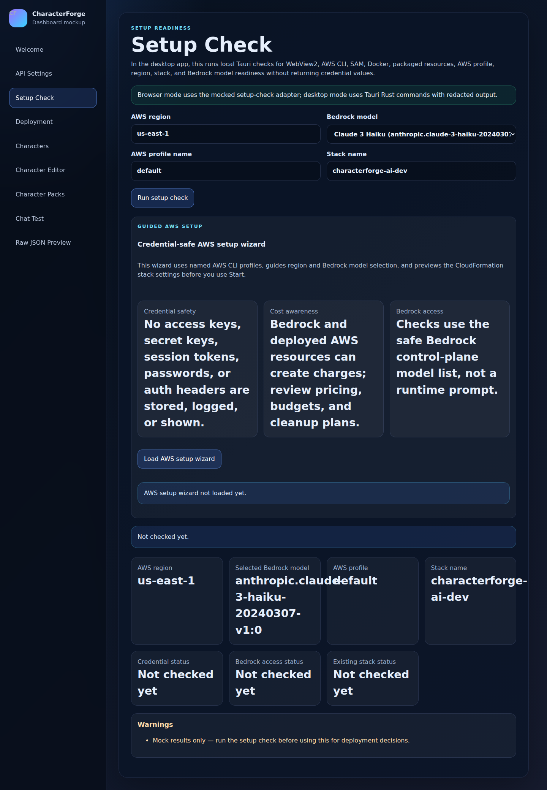
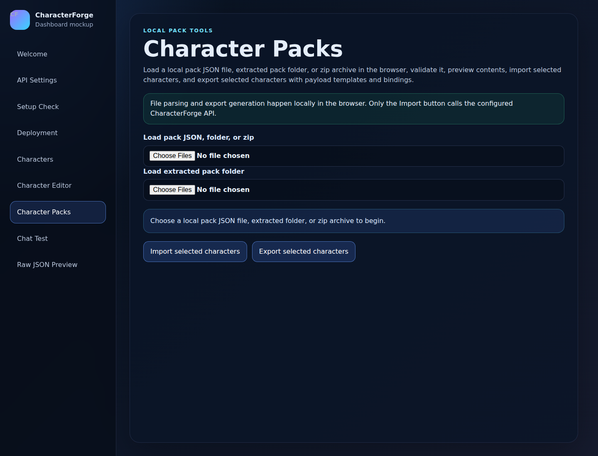

# CharacterForge AI

CharacterForge AI is a desktop-first game AI platform for creating, testing, packaging, and deploying AI-powered game characters. It combines a local Windows application, a guided AWS setup flow, portable character packs, a serverless backend, and game-client integration examples.

---

## Download and install

<details open>
<summary><strong>Windows</strong></summary>

### Current Windows release

- **Installer:** [`characterforgeai-installer.exe`](https://github.com/Cloudygb/CharacterForge-AI/releases/download/v0.1.0-rc1/characterforgeai-installer.exe)
- **Release page:** [`v0.1.0-rc1`](https://github.com/Cloudygb/CharacterForge-AI/releases/tag/v0.1.0-rc1)
- **Installer SHA-256:** `6134f21f4a76f6a2455bd8d0bc1bc2d3915a8272445d257385eacff65fcc5df4`

### How to install on Windows

1. Download [`characterforgeai-installer.exe`](https://github.com/Cloudygb/CharacterForge-AI/releases/download/v0.1.0-rc1/characterforgeai-installer.exe).
2. Open the downloaded installer.
3. If Windows SmartScreen warns that the app is from an unknown publisher, choose **More info** and then **Run anyway** if you trust this release. The current release candidate is unsigned.
4. Finish the installer wizard.
5. Launch **CharacterForgeAI** from the Start Menu or Desktop shortcut.
6. Walk through the first-run tutorial. It explains mock mode, AWS costs, credential safety, and the deployment flow before you connect to live AWS resources.

The Windows desktop app installs locally. Installation by itself does **not** deploy AWS infrastructure, create CloudFormation stacks, call Amazon Bedrock, or store AWS credentials in the repository.

</details>

<details>
<summary><strong>Linux Ubuntu</strong></summary>

A Linux Ubuntu desktop release is **coming soon**.

For now, Ubuntu users can run the source project locally with the developer setup in [`docs/project-details.md`](docs/project-details.md), but there is no packaged Ubuntu installer yet.

</details>

<details>
<summary><strong>macOS</strong></summary>

A macOS desktop release is **coming soon**.

For now, macOS users can run the source project locally with the developer setup in [`docs/project-details.md`](docs/project-details.md), but there is no packaged macOS installer yet.

</details>

---

## About

CharacterForge AI helps game developers and narrative designers turn character ideas into usable game AI systems.

With CharacterForge AI, you can:

- Create structured NPC profiles with personality, backstory, goals, world context, speaking style, roleplay rules, and allowed gameplay actions.
- Test character conversations through a local dashboard before wiring them into a game.
- Return both natural-language dialogue and validated machine-readable action payloads, such as quests, relationship changes, trades, flags, or scene events.
- Import and export reusable character packs.
- Connect game clients through curl examples, a TypeScript SDK, Unity/Unreal guides, or direct HTTP calls.
- Deploy the backend runtime to AWS with a guided SAM/CloudFormation flow when you are ready.

The app is designed to be safe by default: local demo and mock workflows are available before you configure live AWS credentials, and the desktop deployment controls show cost and credential warnings before running cloud commands.

---

## Application screenshots

### Welcome and first-run tutorial


### AWS setup and deployment readiness



### Character dashboard


### Character packs



### Chat test


---

## AWS network architecture

CharacterForge AI deploys a small serverless runtime to AWS. API Gateway receives game-client requests, Lambda routes character/chat/session operations, DynamoDB stores profiles and session history, and Amazon Bedrock Runtime generates in-character structured responses. CloudWatch provides logs, metrics, and dashboard widgets for the deployed stack.


---

## Install and setup guide

### 1. Install the desktop app

Use the Windows installer at the top of this README. After installation, launch **CharacterForgeAI** and complete or skip the first-run tutorial.

### 2. Try the app in mock mode

You can explore the dashboard without AWS:

1. Leave the API base URL blank.
2. Use the character, character-pack, setup, and chat screens in mock/demo mode.
3. Review the generated JSON payloads before connecting to any live backend.

Mock mode is useful for learning the workflow, preparing character data, and testing the UI without cloud costs.

### 3. Prepare AWS only when you want a live backend

A live deployment requires:

- An AWS account.
- AWS CLI v2 installed and configured.
- AWS SAM CLI installed.
- Docker installed and running for SAM builds.
- Permission to use the selected Amazon Bedrock model in your chosen region.
- A local AWS profile or environment-based credentials.

Do **not** commit AWS access keys, API keys, credential files, or generated secrets to this repository.

### 4. Review the guided setup screen

In the desktop app, open the setup/deployment area and confirm:

1. AWS region.
2. Bedrock model ID.
3. Credential readiness.
4. Bedrock access readiness.
5. Existing CloudFormation stack status.
6. Cost and safety warnings.
7. The stack name/environment you intend to deploy.

Browser-only dashboard mode does not run real AWS deployment commands. Live Start/End deployment controls are intended for the trusted local desktop shell.

### 5. Deploy with Start, or deploy manually with SAM

The desktop **Start** flow is designed around AWS SAM and CloudFormation. It previews deployment intent, avoids logging credential values, runs SAM/CloudFormation commands from the local machine, and polls stack status until the deployment reaches a final state.

Manual equivalent:

```bash
aws cloudformation validate-template \
  --template-body file://infra/template.yaml \
  --region us-east-1

sam build --template-file infra/template.yaml
sam deploy --guided --template-file .aws-sam/build/template.yaml
```

The stack creates:

- API Gateway REST API and usage-plan API key.
- Python Lambda router for character, chat, and session requests.
- DynamoDB table for character profiles.
- DynamoDB table for session messages.
- IAM permissions scoped to CharacterForge resources and Bedrock Runtime invocation.
- API Gateway access logs and CloudWatch dashboard widgets.
- CloudFormation outputs for API URL, API key ID, Lambda name, table names, log group, and dashboard name.

### 6. Connect the app to the deployed API

After deployment:

1. Copy the CloudFormation `ApiUrl` output.
2. Retrieve the API Gateway API key value from AWS.
3. In CharacterForgeAI, open API settings.
4. Paste the API base URL and API key into the local app.
5. Test the connection.
6. Create or import characters, then use the chat screen to test live responses.

Keep the API key local. Do not paste real key values into Git commits, screenshots, bug reports, or shared logs.

### 7. Shut down the backend when finished

Use the desktop **End** flow, or delete the CloudFormation stack manually, when you no longer need the live backend.

Before deletion:

1. Export or back up character/session data you want to keep.
2. Confirm the target stack name and region.
3. Review the deletion warning.
4. Wait for CloudFormation to reach a final delete status.

If a deployment rolls back or deletion fails, inspect the CloudFormation events and CloudWatch logs before retrying. Partial stacks may still contain resources that can incur AWS charges.


---

## More documentation

- [AWS deployment guide](docs/aws-deployment.md)
- [Character packs](docs/character-packs.md)
- [Game action bindings](docs/game-bindings.md)
- [Unity integration](docs/game-engines/unity.md)
- [Unreal integration](docs/game-engines/unreal.md)
- [Developer and API reference](docs/project-details.md)
- [OpenAPI contract](openapi.yaml)

---

## License

CharacterForge AI is licensed under the **PolyForm Noncommercial License 1.0.0**. See [`LICENSE`](LICENSE) for the full license text.
