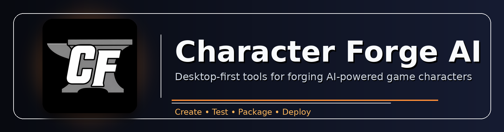
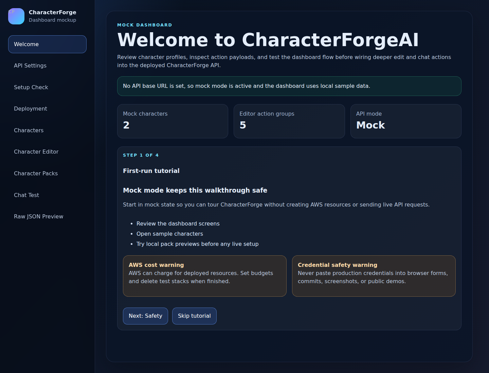
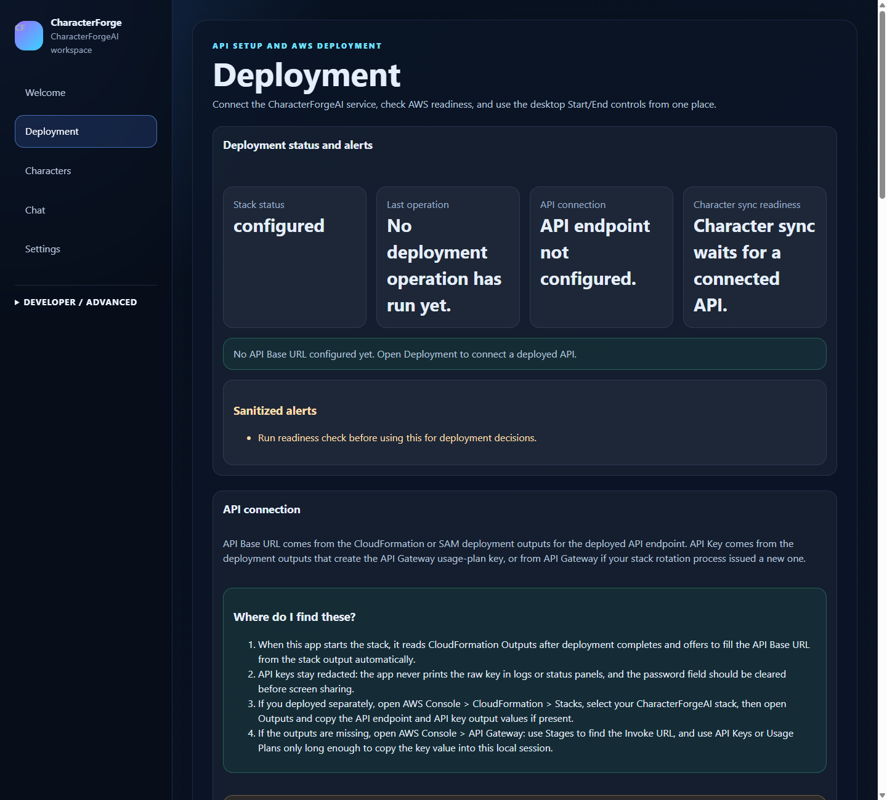
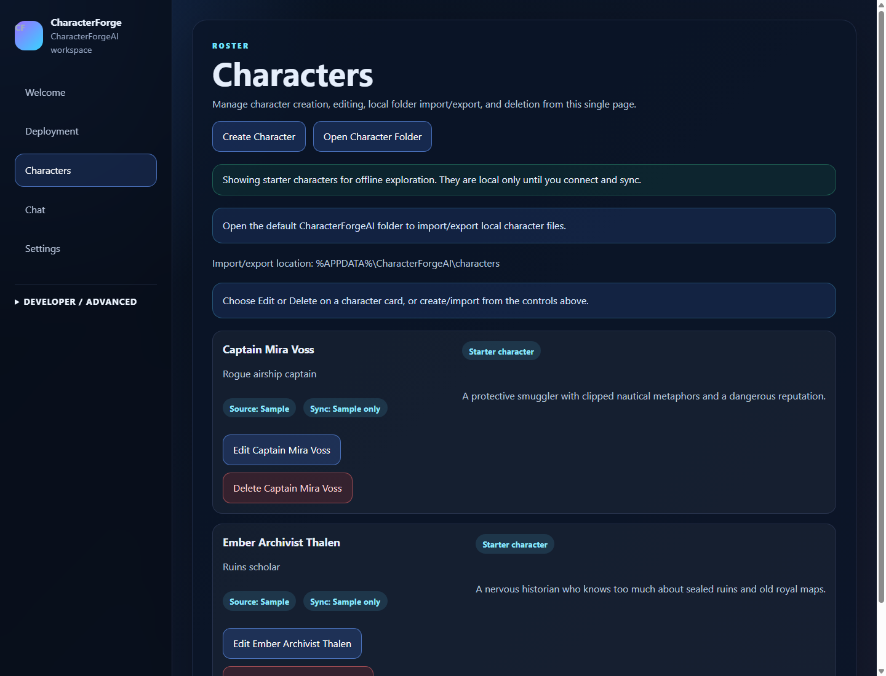
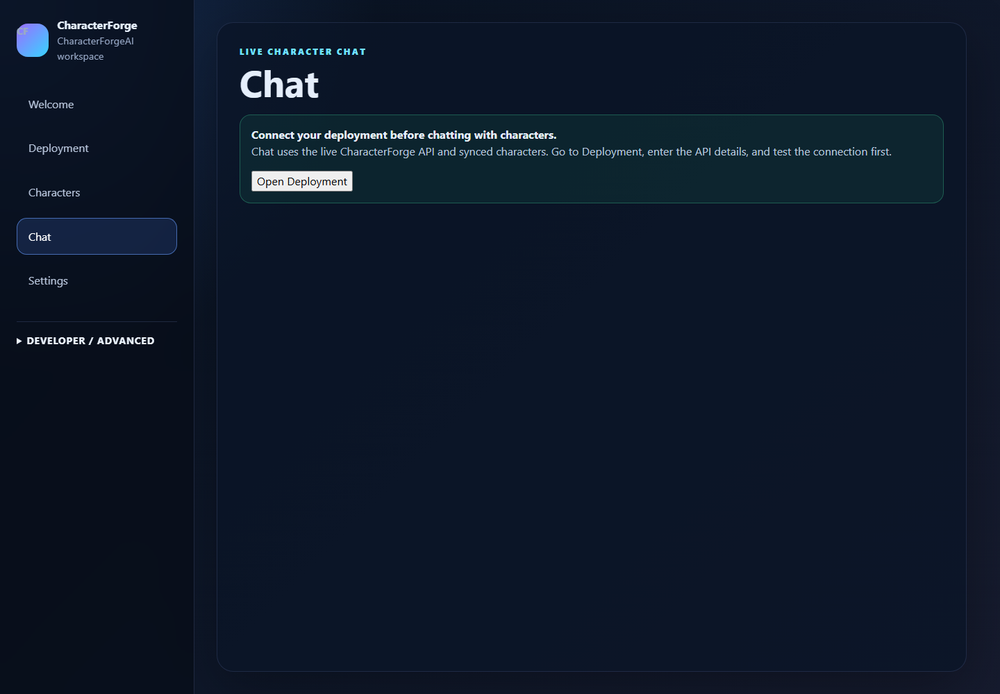
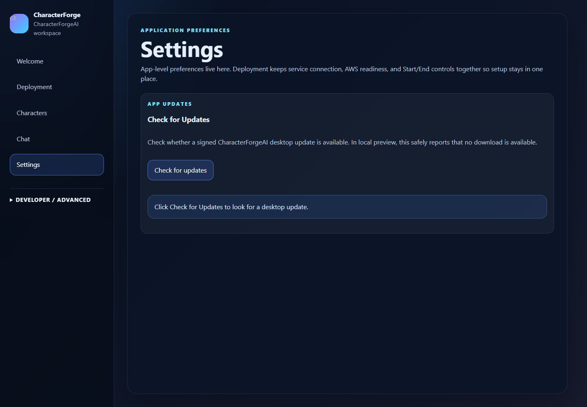
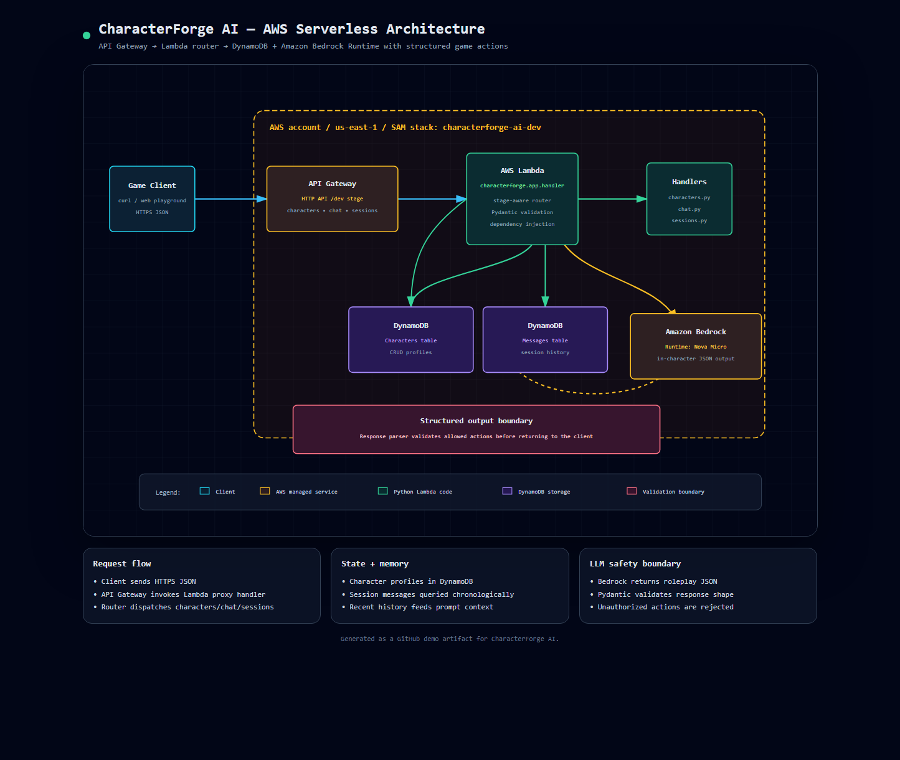

<p align="center">
  
</p>

# CharacterForge AI

CharacterForge AI is a desktop-first game AI platform for creating, testing, packaging, and deploying AI-powered game characters. It combines a local Windows application, a guided AWS setup flow, portable character packs, a serverless backend, and game-client integration examples.

---

## Download and install

<details open>
<summary><strong>Windows</strong></summary>

### Current Windows release

- **Installer:** [`characterforgeai-installer.exe`](https://github.com/Cloudygb/CharacterForge-AI/releases/download/v0.1.0-rc2/characterforgeai-installer.exe)
- **Release page:** [`v0.1.0-rc2`](https://github.com/Cloudygb/CharacterForge-AI/releases/tag/v0.1.0-rc2)
- **Installer SHA-256:** `660d54072af41a14edcd308c5db7b3d06c34ac230c202a9ba4dcac3c14f0fa0d`

### How to install on Windows

1. Download [`characterforgeai-installer.exe`](https://github.com/Cloudygb/CharacterForge-AI/releases/download/v0.1.0-rc2/characterforgeai-installer.exe).
2. Open the downloaded installer.
3. If Windows SmartScreen warns that the app is from an unknown publisher, choose **More info** and then **Run anyway** if you trust this release. The current release candidate is unsigned.
4. Finish the installer wizard.
5. Launch **CharacterForgeAI** from the Start Menu or Desktop shortcut.
6. Walk through the first-run tutorial. It explains AWS costs, credential safety, the Deployment page, character management, and chat before you connect to live AWS resources.

The Windows desktop app installs locally. Installation by itself does **not** deploy AWS infrastructure, create CloudFormation stacks, call Amazon Bedrock, or store AWS credentials in the repository.

</details>

<details>
<summary><strong>Linux Ubuntu</strong></summary>

A Linux Ubuntu desktop release is **coming soon**.

For now, Ubuntu users can run the source project locally with the developer setup in [`docs/project-details.md`](docs/project-details.md), but there is no packaged Ubuntu installer yet.

</details>

<details>
<summary><strong>macOS</strong></summary>

A macOS desktop release is **coming soon**.

For now, macOS users can run the source project locally with the developer setup in [`docs/project-details.md`](docs/project-details.md), but there is no packaged macOS installer yet.

</details>

---

## About

CharacterForge AI helps game developers and narrative designers turn character ideas into usable game AI systems.

With CharacterForge AI, you can:

- Create structured NPC profiles with personality, backstory, goals, world context, speaking style, roleplay rules, and allowed gameplay actions.
- Test character conversations through a local dashboard before wiring them into a game.
- Return both natural-language dialogue and validated machine-readable action payloads, such as quests, relationship changes, trades, flags, or scene events.
- Import and export reusable character packs.
- Connect game clients through curl examples, a TypeScript SDK, Unity/Unreal guides, or direct HTTP calls.
- Deploy the backend runtime to AWS with a guided SAM/CloudFormation flow when you are ready.

The app is designed to be safe by default: local starter workflows are available before you configure live AWS credentials, and the desktop deployment controls show cost and credential warnings before running cloud commands.

---

## Application screenshots

### Welcome



### Deployment



### Characters



### Chat



### Settings



---

## AWS network architecture

CharacterForge AI deploys a small serverless runtime to AWS. API Gateway receives game-client requests, Lambda routes character/chat/session operations, DynamoDB stores profiles and session history, and Amazon Bedrock Runtime generates in-character structured responses. CloudWatch provides logs, metrics, and dashboard widgets for the deployed stack.



---

## Install and setup guide

### 1. Install the desktop app

Use the Windows installer at the top of this README. After installation, launch **CharacterForgeAI** and complete or skip the first-run tutorial.

### 2. Explore locally before connecting AWS

You can learn the desktop flow without AWS:

1. Leave the API Base URL blank.
2. Use **Welcome** to review connection status and the first-run tutorial.
3. Use **Characters** to create, edit, import/export, or delete local starter characters.
4. Use **Chat** to see the connection-required empty state before a live API is configured.
5. Use **Settings** for app-level actions such as update checks.

Local exploration is useful for learning the workflow, preparing character data, and testing UI behavior without cloud costs.

### 3. Prepare AWS only when you want a live backend

A live deployment requires:

- An AWS account.
- AWS CLI v2 installed and configured.
- AWS SAM CLI installed.
- Docker installed and running for SAM builds.
- Permission to use the selected Amazon Bedrock model in your chosen region.
- A local AWS profile or environment-based credentials.

Do **not** commit AWS access keys, API keys, credential files, or generated secrets to this repository.

### 4. Review Deployment

In the desktop app, open **Deployment** and confirm:

1. AWS region.
2. Bedrock model ID.
3. Credential readiness.
4. Bedrock access readiness.
5. Existing CloudFormation stack status.
6. Cost and safety warnings.
7. The stack name/environment you intend to deploy.

Local preview does not run real AWS deployment commands. Live Start/End deployment controls are intended for the trusted packaged desktop app.

### 5. Deploy with Start, or deploy manually with SAM

The desktop **Start** flow is designed around AWS SAM and CloudFormation. It checks readiness, avoids logging credential values, runs SAM/CloudFormation commands from the local machine, discovers stack outputs after launch, and polls stack status until the deployment reaches a final state.

Manual equivalent:

```bash
aws cloudformation validate-template \
  --template-body file://infra/template.yaml \
  --region us-east-1

sam build --template-file infra/template.yaml
sam deploy --guided --template-file .aws-sam/build/template.yaml
```

The stack creates:

- API Gateway REST API and usage-plan API key.
- Python Lambda router for character, chat, and session requests.
- DynamoDB table for character profiles.
- DynamoDB table for session messages.
- IAM permissions scoped to CharacterForge resources and Bedrock Runtime invocation.
- API Gateway access logs and CloudWatch dashboard widgets.
- CloudFormation outputs for API URL, API key ID, Lambda name, table names, log group, and dashboard name.

### 6. Connect the app to the deployed API

After deployment:

1. If Start launched the stack from the desktop app, review the discovered stack outputs in Deployment.
2. If you deployed outside the app, copy the CloudFormation `ApiUrl` output or API Gateway invoke URL.
3. Retrieve the API Gateway API key value from the stack output or API Gateway usage-plan key.
4. In CharacterForgeAI, open **Deployment**.
5. Paste the API Base URL and API Key into the local app's API connection fields.
6. Test the connection.
7. Create or import characters, then use **Chat** to test live responses.

Keep the API key local. Do not paste real key values into Git commits, screenshots, bug reports, or shared logs.

## Curl API Examples

The `examples/curl/` folder contains shell examples for testing the HTTP API from a terminal without embedding live hosts or credentials.

For local SAM testing, start the API with mock LLM responses enabled:

```bash
sam local start-api --env-vars examples/curl/local-env.json
# local-env.json sets USE_MOCK_LLM=true for safe local responses.
```

Then run the local examples:

- `examples/curl/create-character-local.sh` posts a sample character to `http://127.0.0.1:3000`.
- `examples/curl/chat-local.sh` sends a chat request to the local API.

For a deployed stack, set placeholders from your own deployment outputs and keep the API key local to your shell session:

```bash
export API_BASE_URL="https://<api-id>.execute-api.<region>.amazonaws.com/<stage>"
export CHARACTERFORGE_API_KEY="<redacted-api-key>"
```

Then run:

- `examples/curl/create-character-deployed.sh`
- `examples/curl/chat-deployed.sh`

Do not commit real `API_BASE_URL` values for private stacks or real `CHARACTERFORGE_API_KEY` values. The deployed examples send the API key as an `x-api-key` header from the environment variable only.

### 7. Shut down the backend when finished

Use the desktop **End** flow, or delete the CloudFormation stack manually, when you no longer need the live backend.

Before deletion:

1. Export or back up character/session data you want to keep.
2. Confirm the target stack name and region.
3. Review the deletion warning.
4. Wait for CloudFormation to reach a final delete status.

If a deployment rolls back or deletion fails, inspect the CloudFormation events and CloudWatch logs before retrying. Partial stacks may still contain resources that can incur AWS charges.


---

## More documentation

- [Desktop quickstart](docs/desktop-quickstart.md)
- [AWS deployment guide](docs/aws-deployment.md)
- [Character packs](docs/character-packs.md)
- [Game action bindings](docs/game-bindings.md)
- [Unity integration](docs/game-engines/unity.md)
- [Unreal integration](docs/game-engines/unreal.md)
- [Project details and API usage guide](docs/project-details.md)
- [OpenAPI contract](openapi.yaml)

---

## License

CharacterForge AI is licensed under the **PolyForm Noncommercial License 1.0.0**. See [`LICENSE`](LICENSE) for the full license text.
